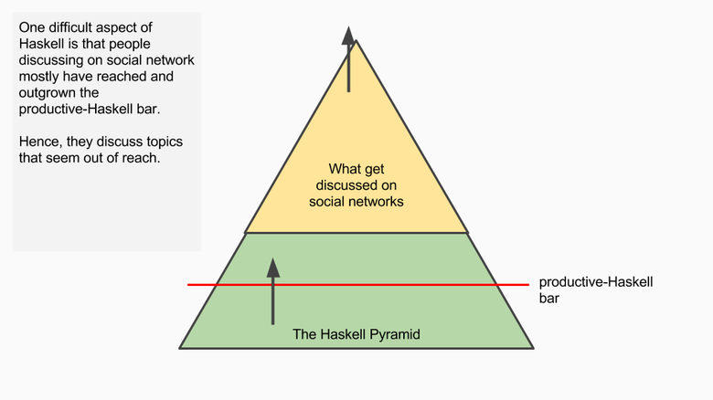
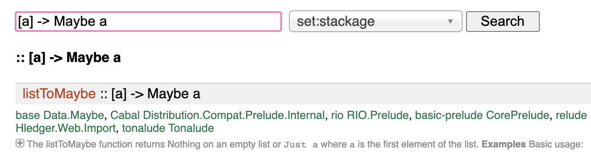

### 2019 had been a very particular year for me.

In October 2018 I had the opportunity to join Decathlon Offer Team, as a “junior” developper, to work on Marketplace project for Decathlon. “Junior”, because since I joined Decathlon in December 2015, I stopped to code and had a lot of experiences in support teams in different domains. Before that, I had several development experiences in `C#, Java` and `VBA` (yeah, `VBA` ).

We are now in march 2019, I was starting to feel confident, becoming autonomous on my daily job, understanding the purpose of the project and how my team contributes to it.  
On my _(almost)_ daily running session at break lunch, while starting a new training plan for a marathon, I got hit by a car, on a pedestrian crossing. The car was going at nearly 50km/h and the shock was really hard _(maybe it was even harder for my colleague running with me who witnessed the accident)_. My head and my left shoulder _(tried to)_ stop the car.


_Stopping a car with your head is not a good idea at all, please do not try it._

The days, weeks and months following the accident, I had terrible headaches. They were so painful that I couldn’t even watch a movie without pain. Even having a discussion with two persons was difficult, I was able to handle it, but in the end, the headache was terrible and I had to rest for hours…  
After three months of intensive rest and efforts to come back to a normal life, on 3rd of June, I went back to work, four afternoons per week _(thanks french health system)._

> How the hell is this introduction linked to Haskell?!

## One Catalog

### Ease experiences with catalog for Decathlon and its partners

One Catalog provides a set of modules to manage sports product catalogs based on schema.org data structure and Decathlon referential data structure (like sports, product types, levels of practice…).

As a product provider, you will be able to add and manage products AND services. One Catalog centralizes, ensures data integrity (structure and referential data) and broadcasts them to Decathlon and its partners.

As a digital experience, you will be able to retrieve a unified and standardized catalog filled with sporting goods, sport places, sport coaching or any sport related services provided by Decathlon and its partners.

Around the 10th of June, Rémi my dear and loved colleague told us

> Should we do it in Haskell?


_Me, when Rémi asked the previous question…_

The important point is that the only experience we both had in functional programming was a PoC in `Elm` a few months ago…

## Why was Haskell eligible?

When One Catalog receives normalized product sheets for a locale _(fr-FR for example)_ it:  
1- Validates the product sheet structure _(structure we defined and are responsible for)_  
2- Validates the identifiers in the provided product sheet _(are they known from the Decathlon referentials?)_  
3- Denormalizes it, by adding the translated label in the provided locale for the given identifiers.

The crux of our business is to guarantee and **ensure** **every product sheets going through are consistent in terms of file format and related data.**  
**We wanted to use a language with the same _mindset_, Haskell was a clever choice thanks to its type system and immutability.**

## The difficulties I faced

### Am I the dumbest people coding with Haskell? 🤔

This was really hurting at the beginning… My first pull request was to validate _(or not)_ a JWT token. **I needed one afternoon** _(since I was working at 40% at this time, it was like one day for me)._

Then I heard about the [**Haskell Pyramid**](https://patrickmn.com/software/the-haskell-pyramid/)**.**



> **First takeaway:**
>
> **You are productive, far before encountering the discussions on the Internet… Do not be afraid!**

### Monads


The first sentence which was really obscure for me was

> This is a monad, you have to bind.

Ok dude. Fully understood what you said _(I was lying)._

You definitively should have a look on this [post](https://adit.io/posts/2013-04-17-functors,_applicatives,_and_monads_in_pictures.html#monads) which helped me a lot to understand _Functors_, _Applicatives_ and _Monads_.

> **Second takeaway (I will quote the previous** [**post**](https://adit.io/posts/2013-04-17-functors,_applicatives,_and_monads_in_pictures.html#monads)**):**
>
> **How to learn about Monads:  
> 1\. Get a PhD in computer science  
> 2\. Throw it away because you don’t need it for this section!**

### Functional programming glossary

There are so many concepts to see, use _(or not)_ and understand _(or not)_ in Haskell. It is a mathematical functional programming language. Hence, there is a word _(and a complicated definition)_ for each…  
This can be really discouraging at first sight and I felt _(often)_ like the dumbest people coding with Haskell… Nevertheless I was productive and this is directly related to the _Haskell-pyramid:_ **_You only need a few to be productive._**


_Am I a genius?_

> **Third takeaway:**
>
> **Don’t spend to much time theorizing advanced concepts you will surely never use**

### Higher order function

It is a function requesting a function as parameter, or returning a function.

The function [filter](https://hackage.haskell.org/package/base-4.16.0.0/docs/Prelude.html#v:filter) is a pretty good example. Its first parameter is the predicate you want to satisfy to filter the data from the given array (the second parameter).

The first time, it was kinda strange, but since I already knew the lambda in Java, it was not so hard to understand and use.  
The hardest use case was on our denormalization functions:

```haskell
buildDenormalizer :: 
  SmallThingToDenormalize -> 
  ( [Label], ThingContainingSmallThingToDenormalize -> SmallThingToDenormalize )
```

Working on these functions was quite difficult _(at this time I was working at 80%)_ and gave me a lot of headaches…

> **Fourth takeaway:**
>
> **If you want to make it in a functional way, you have to think different from OOP**

### Strong type and immutability

In the first section, I said I needed one afternoon to check if a JWT token was valid or not. Strong type and immutability were part of responsible _(and the IO and Maybe Monads, to be honest)_.

When it’s your first time, you don’t have any idea of how to compare one `Maybe IntDate` to an `IO POSIXTime` in order to return an… `IO Bool`

> **Fifth takeaway:**
>
> **Nothing will be done implicitly for you. You have to define a** `ToJSON` **and a** `FromJSON` **instance**

```haskell
instance ToJSON (BasicProperty 'BeforeDenormalization) where  
  toEncoding BasicProperty {..} =  
    pairs  
      ( "@type" .= ("PropertyValue" :: Text)  
          <> "@propertyType" .= ("BasicPropertyValue" :: Text)  
          <> "propertyID" .= _propertyID  
          <> "value" .= _value  
      )instance FromJSON (BasicProperty 'BeforeDenormalization) where  
  parseJSON = withObject "BasicProperty" \o -> do  
    checkStaticField "@type" "PropertyValue" o  
    _propertyID <- o .: "propertyID"  
    _value <- o .: "value"  
    pure BasicProperty {_propertyID, _value, _name = ()}
```

Sometimes you have to write it totally manually ☝️  
And sometimes you can rely on your lib 👇

```haskell
instance ToJSON MyCustomId where  
  toEncoding = genericToEncoding newtypeOptions

instance FromJSON MyCustomId where  
  parseJSON = genericParseJSON newtypeOptions
```

## What I loved

### GHCI ❤️

When coding with an other language, I spent a lot of time trying to understand why I was facing this error at runtime…  
With Haskell, my new best friend _(even if it yells at me)_ is the compiler!  
It displays explicit messages _(almost every time),_


### Feedbacks loop 🚀

This is the logical end of the previous point. If my compiler says **_“ok”_** the application will do exactly what I want.  
I even propose changes to review without having to run the application and make some applicative tests on it.

### TDD for Type Driven Development

The good side of the strongly typed system and immutability!  
_Steps to follow:
1) Change the type at the main place
2) Compile
3) Fix the error displayed in terminal  
   Repeat 2–3 until the tests passed._

Recently I had to make a change in our model:

```haskell
-- Previous model  
foo :: [Text\  
-- New model  
foo :: NonEmpty Text
```

This data must be denormalized. Hence, it is used almost everywhere in our codebase. **This refactor took me around 10 minutes.** It was deployed in qualification a few minutes later and the following day in production.

### [Hoogle](https://hoogle.haskell.org/) 📖

At first sight, I did not know how to use it. But once you are used to deal with types, this becomes magical!

The search by signature is really helpful:



My data is wrapped in a list, how can I get rid of this list? Let’s Hoogle it!

### Intuitive, explicit and easily readable

One day, I was blocked while trying to write something. I don’t remember totally the subject, but I asked help from one teammate, and just start explaining what I wanted to code.

> - Oh ok, then just write it  
> - What do you mean? It’s because I have no idea on how to write this that I asked for help…  
> - Yeah, just write what you told me

Guess what… I simply did it and it worked! Of course, this is not always the case… That’s for the intuitive part.

About the explicit and readability, an example always beats an explanation, thanks to the type system and Polysemy to wrap `IO` things in Algebraic Effects _(remember the #glossary section? 😆):_

```haskell
createData :: Members '[Log, Database] r => Input -> Sem r ()
```

From my point of view, it looks crystal clear. I exactly know what to expect from this function and where to be attentive.

### Pattern matching

One concrete example of how useful is this feature, is when dealing with `Either` :

```haskell
case (eitherData, eitherDataKey) of  
  (Right (UpdatedData data), Right \_) -> updateData data  
  (Right DeletedData, Right dataKey) -> deleteData dataKey  
  (Left errorMessage, \_) -> log Alert "Failed to parse Data"  
  (\_, Left errorMessage) -> log Alert "Failed to parse Data Key"
```

When reviewing this kind of code suggestion, you can easily find out what will be the behavior of your application!

### Testing 🤞


_When I launch “stack test”_

All the pure functions _(without_ `_IO_`_)_ are easily testable! We even set a lot of property tests. This is really comfortable and satisfying. When you see _560 tests passed_ you feel happy and confident about the robustness of your code suggestion.  
The un-pure functions are not so difficult to test. We are able to `mock` almost everything!  
I think the real killer-feature we have are our `full chain tests` . We just _“run” (with mocked data)_ our application on input product sheets available in our documentation! And the results must be the exact outputs we also provide in our documentation!  
**If these tests are not passing anymore, or if you have to modify the inputs / outputs, you definitively broke something!**

## Two steps back

I really enjoyed this experience. **I think this is the best experience I ever had.** Maybe the only one where we spend much time thinking and coding than debugging or solving existing troubles…  
Of course, everything is not easy and pink. But I do not think it is more complex than for any other new language or tool you start using.

Thanks to the property tests, immutability and type system, **I really feel confident about the code I produce.**  
Thanks to the whole team, I never felt alone. The community also helped me, every member is passionate and want to share and help each other. Just have a look on Stackoverflow, every Haskell answer is detailed and helpful.

I define myself as a perpetual learner and a pragmatic software engineer. **I believe the hardest part of my job is to wisely choose my tools.**

### Recently, I discovered the [Maslow's hammer](https://en.wikipedia.org/wiki/Law_of_the_instrument):

> If the only tool you have is a hammer, everything looks like a nail.

This hammer changed my way to think software engineering. Now, I do believe we are engineers, and like other engineers, we should rely _(when possible)_ on strong mathematics principles.  
I do believe it’s worth it to learn a new language, or consider a new framework, or use a new tool, or try a new methodology, or whatever… Of course, you must have solid arguments to convince your teammates or your managers and define solid KPIs to prove it.

**To conclude, how does your technical stack looks like?**  
- Expose and consume HTTP REST APIs  
- Consume and produce Kafka messages  
- Persist with a PostgreSQL database  
- Build with Jenkins  
- Kubernetes & Docker on Google Cloud Platform  
- Flux for continuous deployment  
- Grafana to monitor and alert

### I am still searching, but except Haskell instead of Java I cannot find any differences...

I like to think:

> From Software Developer to Software Engineer thanks to Haskell

I used to be Software Developer, coding functioning applications. **Now, I am a Software Engineer, coding robust applications that will work for ever.**

## I do think it worth it to learn Haskell and to use it in production.

Hence, I will finish with a question:

# Should you do it in Haskell?
